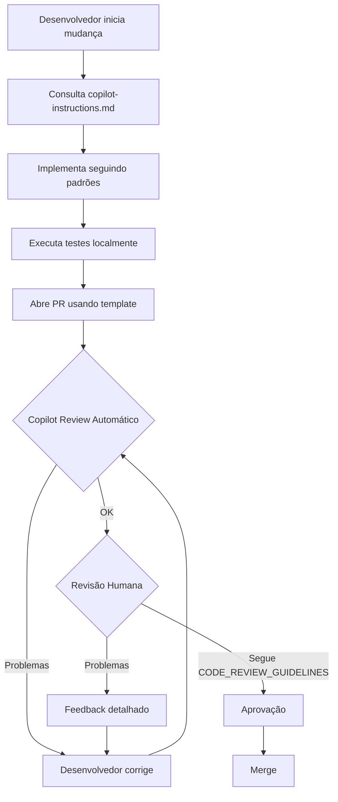

# Arquivos de Instruções e Automação

Este diretório contém arquivos de configuração e instruções para auxiliar no desenvolvimento e revisão de código do BrasilAPI.

## 📚 Arquivos de Instrução

### 🤖 Para GitHub Copilot e Desenvolvedores

#### [`copilot-instructions.md`](copilot-instructions.md)
**Propósito:** Instruções gerais para desenvolvimento assistido por IA

**Uso:**
- Referenciado automaticamente pelo GitHub Copilot durante desenvolvimento
- Guia para desenvolvedores entenderem padrões do projeto
- Define princípios fundamentais: compatibilidade, documentação, custos, qualidade

**Conteúdo:**
- Visão geral e missão do projeto
- Arquitetura e padrões de código
- Workflow para criar endpoints
- Exemplos de código e testes
- FAQ e comandos úteis

#### [`copilot-review-instructions.md`](copilot-review-instructions.md)
**Propósito:** Instruções específicas para revisão automática de PRs pelo GitHub Copilot

**Uso:**
- Treina o Copilot para revisar PRs seguindo nossos padrões
- Define critérios objetivos de aprovação/rejeição
- Automatiza parte do processo de code review

**Conteúdo:**
- Regras não-negociáveis (breaking changes, documentação, testes, segurança)
- Checklist obrigatória de revisão em 7 categorias
- Templates de feedback específico para cada tipo de problema
- Priorização: crítico vs importante vs sugestão
- Casos especiais (doc-only, dependabot, refatoração)

**Como funciona:**
1. Desenvolvedor abre PR
2. GitHub Copilot lê este arquivo
3. Copilot analisa mudanças seguindo checklist
4. Copilot comenta problemas encontrados com soluções específicas
5. Copilot sugere aprovação ou solicita mudanças

### 👥 Para Revisores Humanos

#### [`CODE_REVIEW_GUIDELINES.md`](CODE_REVIEW_GUIDELINES.md)
**Propósito:** Guia completo para revisores humanos

**Uso:**
- Consulta durante revisão manual de PRs
- Treinamento de novos revisores
- Referência para critérios de qualidade

**Conteúdo:**
- Checklist detalhada de revisão
- Como verificar compatibilidade de API
- Como validar documentação e testes
- Como avaliar performance e custos
- Como identificar vulnerabilidades
- Como dar feedback efetivo
- Red flags para rejeição imediata

### 📝 Para Contribuidores

#### [`PULL_REQUEST_TEMPLATE.md`](PULL_REQUEST_TEMPLATE.md)
**Propósito:** Template automático para todos os PRs

**Uso:**
- Aplicado automaticamente ao abrir novo PR
- Guia contribuidor no checklist antes de submeter
- Garante que informações essenciais sejam fornecidas

**Conteúdo:**
- Checklists de compatibilidade, documentação, testes, código
- Seção para descrever como testar
- Instruções para revisores
- Lembretes sobre impacto em produção

## 🔄 Workflow de Contribuição



## 🎯 Diferença entre os Arquivos

| Arquivo | Audiência | Momento | Foco |
|---------|-----------|---------|------|
| `copilot-instructions.md` | Copilot + Devs | Durante desenvolvimento | Como escrever código |
| `copilot-review-instructions.md` | Copilot | Durante review automático | Como revisar código |
| `CODE_REVIEW_GUIDELINES.md` | Revisores humanos | Durante review manual | Como revisar profundamente |
| `PULL_REQUEST_TEMPLATE.md` | Contribuidor | Ao abrir PR | O que incluir no PR |

## 🚀 Utilizando as Instruções de Revisão

> **Nota**: As instruções de revisão automática estão preparadas para uso com GitHub Copilot e ferramentas similares de revisão assistida por IA. A disponibilidade e o método de ativação podem variar conforme o plano do GitHub e recursos da organização.

### Para Mantenedores
O arquivo `copilot-review-instructions.md` serve como guia para:
1. **Revisão manual**: Use como checklist ao revisar PRs
2. **Revisão assistida**: GitHub Copilot pode referenciar estas instruções ao fornecer sugestões
3. **Treinamento**: Base para treinar novos revisores

### Solicitando Revisão do Copilot
Se disponível na sua organização, você pode solicitar análise do Copilot comentando no PR:
```
@copilot review this PR following .github/copilot-review-instructions.md
```

### Configuração Futura
À medida que o GitHub Copilot expande recursos de revisão automática, este repositório já estará preparado com instruções detalhadas. Acompanhe atualizações em [GitHub Copilot Enterprise](https://docs.github.com/en/copilot/github-copilot-enterprise) para novos recursos.

## 📖 Mantendo as Instruções

### Quando Atualizar

**`copilot-instructions.md`:**
- Novos padrões de código são adotados
- Mudanças em arquitetura
- Novos comandos ou ferramentas
- Lições aprendidas de erros comuns

**`copilot-review-instructions.md`:**
- Novos tipos de problemas frequentes em PRs
- Mudanças em critérios de aprovação
- Novos checks automatizados necessários
- Feedback que deve ser padronizado

**`CODE_REVIEW_GUIDELINES.md`:**
- Processos de revisão evoluem
- Novos requisitos de qualidade
- Melhores práticas são descobertas

**`PULL_REQUEST_TEMPLATE.md`:**
- Informações faltando frequentemente em PRs
- Novos checks necessários antes do merge

### Como Atualizar

1. Abra PR com mudanças nas instruções
2. Explique motivo da mudança
3. Se possível, referencie PRs que motivaram a mudança
4. Peça feedback de outros mantenedores
5. Merge após aprovação

## 🎓 Filosofia do Projeto

Todos esses arquivos refletem os princípios fundamentais do BrasilAPI:

1. **🔒 Compatibilidade é sagrada**: Nunca quebre aplicações existentes
2. **📝 Documentação é obrigatória**: Código sem doc não existe
3. **💰 Custos devem ser zero**: Projeto deve ser sustentável sem financiamento
4. **🔐 Segurança em primeiro lugar**: Proteção de dados e validação sempre
5. **✅ Qualidade é mandatória**: Testes, linting, padrões são obrigatórios
6. **🌍 Open-source e comunidade**: Decisões transparentes e colaborativas

## 📞 Dúvidas?

- Para dúvidas sobre desenvolvimento: Ver `copilot-instructions.md`
- Para dúvidas sobre revisão: Ver `CODE_REVIEW_GUIDELINES.md`
- Para dúvidas sobre contribuição: Ver `/CONTRIBUTING.md`
- Para issues: [github.com/BrasilAPI/BrasilAPI/issues](https://github.com/BrasilAPI/BrasilAPI/issues)

---

**Mantido pela comunidade BrasilAPI** 🇧🇷
